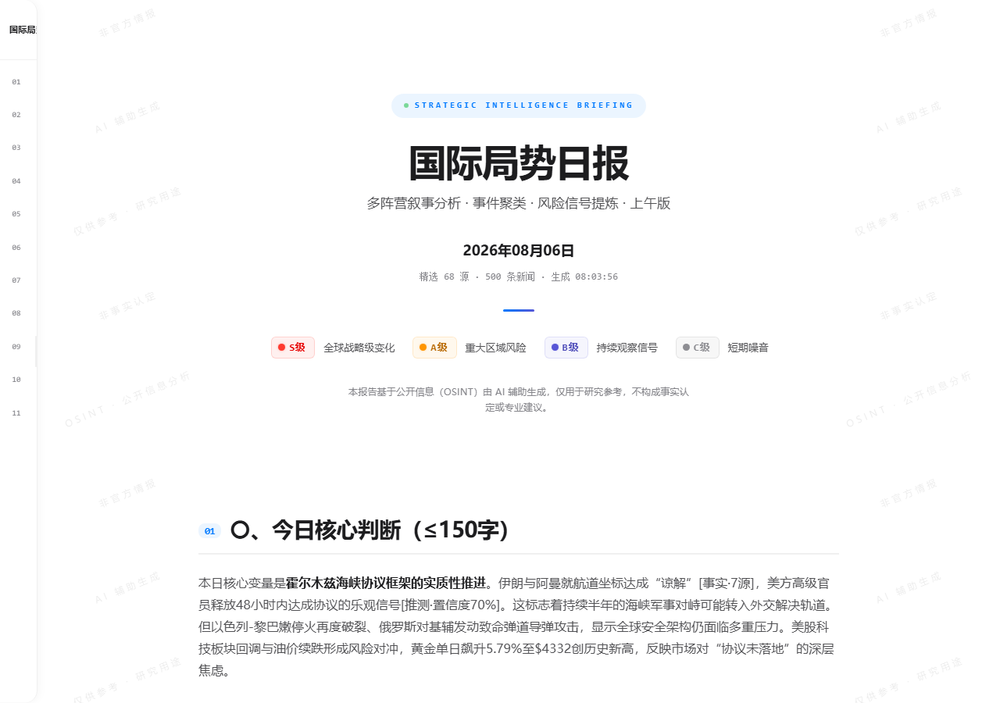
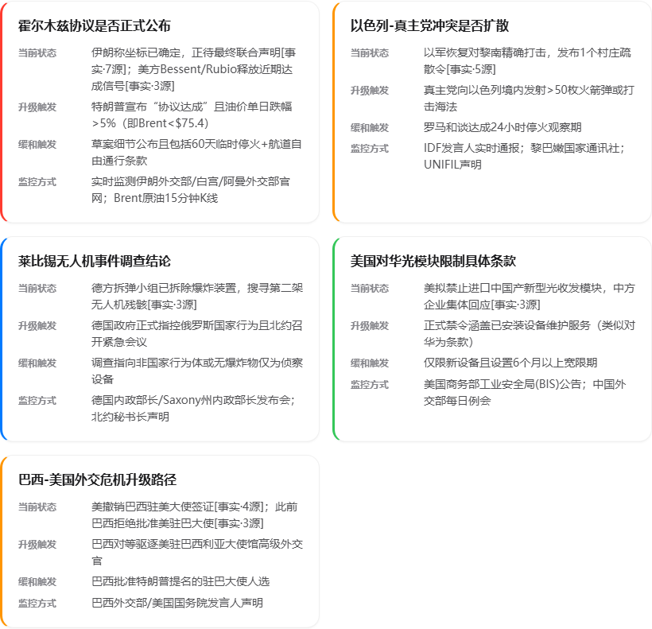
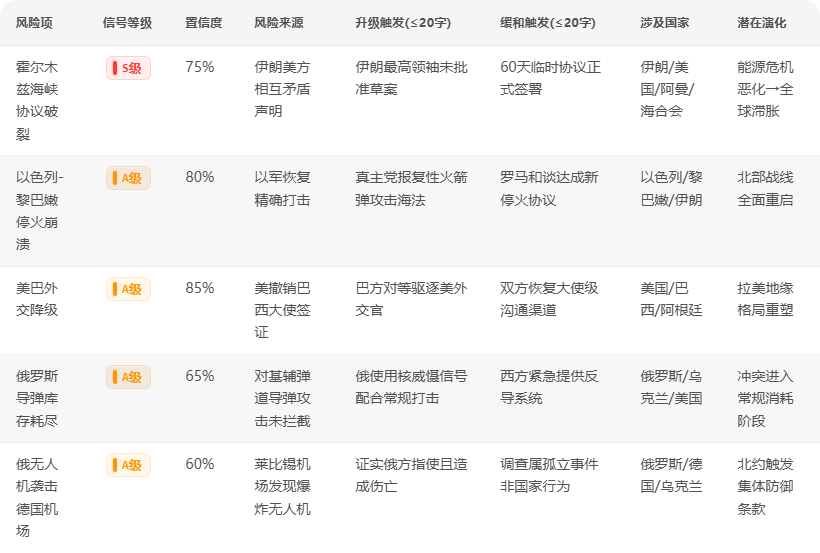

<p align="center">
  <h1 align="center">🔭 PrismLens</h1>
  <p align="center"><strong>Every morning, understand the world in five minutes.</strong></p>
  <p align="center">
    <b>English</b> | <a href="README.md">中文</a>
  </p>
  <p align="center">
    
    
    
  </p>
</p>

> PrismLens turns **100+ global news sources** into a professional geopolitical intelligence briefing, generated daily by AI.
> Not a news digest — intelligence analysis: **multi-perspective narratives · risk transmission chains · 90-day event memory**.



---

## Why PrismLens

| | ChatGPT | RSS Readers | PrismLens |
|---|:---:|:---:|:---:|
| **Auto-delivery** | ✗ Must ask | ✓ But you filter | ✓ Arrives daily |
| **Long-term memory** | ✗ Stateless | ✗ | ✓ 90-day event tracking |
| **Multi-source synthesis** | ✗ Single query | ✗ One at a time | ✓ 100+ sources analyzed together |
| **Narrative comparison** | ✗ Must prompt | ✗ | ✓ Multi-perspective by default |
| **Risk transmission** | ✗ DIY analysis | ✗ | ✓ Automatic financial impact chains |
| **Historical trends** | ✗ | ✗ | ✓ Full event lifecycle |

ChatGPT waits for your questions. **PrismLens comes to you every morning.**

---

## What the briefing looks like

A complete 10-chapter intelligence briefing, with core sections like:

**48-Hour Key Watchpoints** — one card per risk: current status, escalation/de-escalation triggers, monitoring method



**Top Priority Risk Matrix** — probability × impact × quantified transmission chains



**[📰 View a full sample briefing →](https://htmlpreview.github.io/?https://github.com/vanthree31/PrismLens/blob/main/samples/%E6%AF%8F%E6%97%A5%E7%AE%80%E6%8A%A5-2026-08-04.html)** *(2026-08-04)*

---

## Core capabilities

### Multi-perspective narratives

The same event, five viewpoints. How does CNN report it? RT? Xinhua? Al Jazeera?

It doesn't just tell you *what happened* — it tells you *how each side sees it*.

### Event memory

The AI doesn't only summarize today. It knows yesterday, last week, the 90-day trend.

Today's Iran–US standoff is not "a news item" — it's **Day 47 of the event**, and the AI remembers every step from Day 1.

### Risk transmission chains

It doesn't tell you "oil prices went up". It tells you:

```
Middle East conflict → Strait of Hormuz disruption → oil↑ → inflation↑ → Treasury yields↑ → tech valuations↓ → gold↑
```

This is not a news summary. This is intelligence analysis.

### Why it matters

Not "the US announced new tariffs on China today".

But "this is the 4th escalation in 90 days, expanding from chips to AI infrastructure. Likely impact: NVIDIA Q3 China revenue estimates cut 15-20%..."

---

## Architecture

```
100+ RSS sources (parallel fetch)
        │
        ▼
  Context Builder (news + yesterday events + market data + 90-day trends)
        │
        ▼
  1M Context LLM (single inference)
        │
        ▼
  Briefing (HTML) + Structured JSON
        │
   ┌────┼────┬──────────┬──────────┐
   ▼    ▼    ▼          ▼          ▼
 Brief  JSON  Email  Telegram  Event DB
                              (SQLite 5-table)
```

- **Single-stage long-context pipeline** — the AI sees everything at once, not stitched together
- **Event knowledge graph** — tracks the same event across days, auto-detects escalation/de-escalation/merge
- **Event Database (SQLite)** — 5-table schema as AI long-term memory; events never deleted, analyses fully versioned
- **Risk transmission engine** — 9 quantified chains from geopolitical events to financial markets

---

## Open Source Notice

⚠️ **Important**: this repository is the open-source showcase of the PrismLens core engine. The full 101-source configuration, scoring algorithms, and Pro capabilities (complete 10-chapter briefing, narrative comparison, 90-day memory, S/A-level alert push) are part of the **commercial licensed edition** and are not included.

## Quick Start

```bash
git clone https://github.com/vanthree31/PrismLens.git
cd PrismLens
pip install -r requirements.txt
cp .env.example .env   # add your DeepSeek API key (or any OpenAI-compatible API)
```

> The open-source edition requires you to provide your own news source config (`config/sources.yaml`, see `sources.yaml.example`). For the full source configuration, contact: vanthree31@gmail.com

**Requirements:** Python 3.10+ · DeepSeek API key

---

## Editions

| | Free | Pro |
|---|:---:|:---:|
| **Briefing** | 3-chapter summary | Full 10-chapter analysis |
| **Sources** | Curated | 100+ full coverage |
| **Narrative comparison** | — | Multi-perspective |
| **Historical memory** | — | 90 days |
| **Transmission chains** | — | 9 quantified |
| **Alerts** | — | S/A-level push |

**Pro license:** vanthree31@gmail.com

---

## License

Open Core — core engine MIT. Pro features require a commercial license.

[LICENSE](LICENSE)
